# PowerJob 源码深度分析

> PowerJob（原 OhMyScheduler）是全新一代分布式调度与计算框架，支持定时调度、DAG 工作流、MapReduce 分布式计算等能力。


---

## 一、整体架构概览

### 1.1 模块划分

PowerJob 采用多模块 Maven 工程结构，核心模块如下：

```
PowerJob
├── powerjob-common          # 公共模块：枚举、模型、工具类
├── powerjob-remote          # 远程通信框架（可插拔）
│   ├── powerjob-remote-framework      # 通信框架抽象层
│   ├── powerjob-remote-impl-akka      # Akka 实现
│   ├── powerjob-remote-impl-http      # HTTP/Vertx 实现
│   └── powerjob-remote-impl-mu        # 自研 Mu 实现
├── powerjob-server          # 调度服务端
│   ├── powerjob-server-starter        # 启动模块 + Web 层
│   ├── powerjob-server-core           # 核心调度逻辑
│   ├── powerjob-server-common         # 服务端公共模块（时间轮等）
│   ├── powerjob-server-persistence    # 持久化层
│   ├── powerjob-server-remote         # 服务端远程通信
│   ├── powerjob-server-auth           # 认证鉴权
│   ├── powerjob-server-extension      # 扩展点定义
│   ├── powerjob-server-monitor        # 监控
│   └── powerjob-server-migrate        # 数据迁移
├── powerjob-worker           # 执行器（Worker）
│   ├── powerjob-worker                 # Worker 核心
│   ├── powerjob-worker-agent           # Agent 模式
│   ├── powerjob-worker-samples         # 示例
│   └── powerjob-worker-spring-boot-starter  # Spring Boot Starter
├── powerjob-client           # 客户端（OpenAPI）
└── powerjob-official-processors  # 官方处理器
```

### 1.2 整体架构图

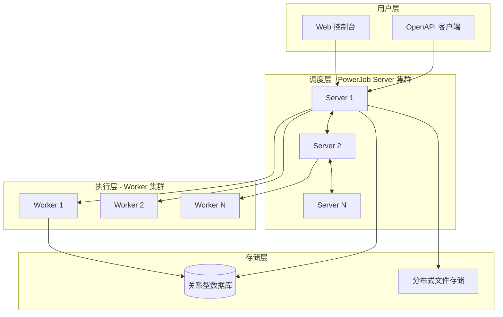
```mermaid
graph TB
    subgraph "用户层"
        WEB[Web 控制台]
        API[OpenAPI 客户端]
    end

    subgraph "调度层 - PowerJob Server 集群"
        S1[Server 1]
        S2[Server 2]
        S3[Server N]
    end

    subgraph "执行层 - Worker 集群"
        W1[Worker 1]
        W2[Worker 2]
        W3[Worker N]
    end

    subgraph "存储层"
        DB[(关系型数据库)]
        DFS[分布式文件存储]
    end

    WEB --> S1
    API --> S1
    S1 <--> S2
    S2 <--> S3
    S1 --> W1
    S1 --> W2
    S2 --> W3
    W1 --> DB
    S1 --> DB
    S1 --> DFS
```

---

## 二、核心调度引擎深度分析

### 2.1 调度引擎整体流程

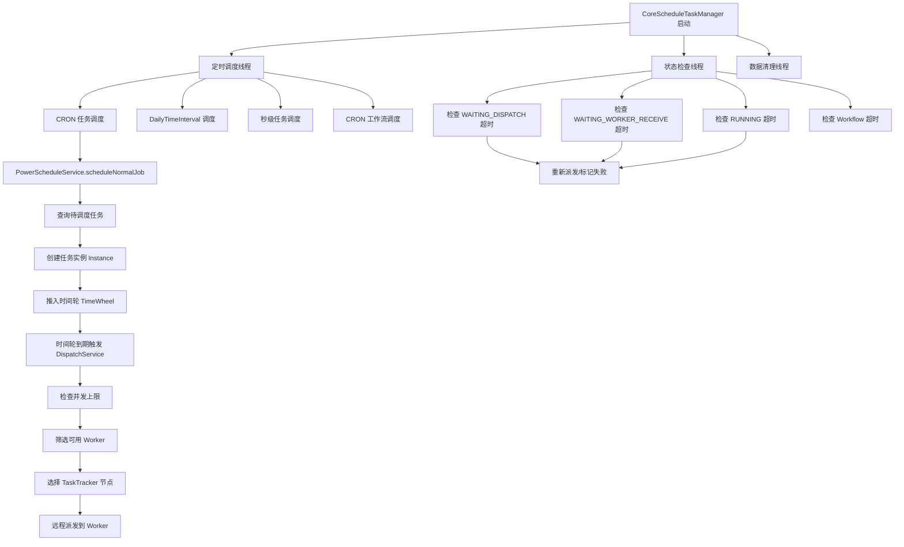
```mermaid
flowchart TD
    A[CoreScheduleTaskManager 启动] --> B1[定时调度线程]
    A --> B2[状态检查线程]
    A --> B3[数据清理线程]

    B1 --> C1[CRON 任务调度]
    B1 --> C2[DailyTimeInterval 调度]
    B1 --> C3[秒级任务调度]
    B1 --> C4[CRON 工作流调度]

    C1 --> D[PowerScheduleService.scheduleNormalJob]
    D --> E1[查询待调度任务]
    E1 --> E2[创建任务实例 Instance]
    E2 --> E3[推入时间轮 TimeWheel]
    E3 --> E4[时间轮到期触发 DispatchService]

    E4 --> F1[检查并发上限]
    F1 --> F2[筛选可用 Worker]
    F2 --> F3[选择 TaskTracker 节点]
    F3 --> F4[远程派发到 Worker]

    B2 --> G1[检查 WAITING_DISPATCH 超时]
    B2 --> G2[检查 WAITING_WORKER_RECEIVE 超时]
    B2 --> G3[检查 RUNNING 超时]
    B2 --> G4[检查 Workflow 超时]

    G1 --> H[重新派发/标记失败]
    G2 --> H
    G3 --> H
```

### 2.2 调度核心类详解

#### CoreScheduleTaskManager — 调度任务管理器

[CoreScheduleTaskManager](file:///d:/workspace/java_projects/source_projects/PowerJob/powerjob-server/powerjob-server-core/src/main/java/tech/powerjob/server/core/scheduler/CoreScheduleTaskManager.java) 是整个调度引擎的入口，在 Spring 容器初始化后启动 9 个核心后台线程：

| 线程名 | 功能 | 调度间隔 |
|--------|------|----------|
| ScheduleCronJob | 调度 CRON 表达式任务 | 15s |
| ScheduleDailyTimeIntervalJob | 调度每日固定间隔任务 | 15s |
| ScheduleCronWorkflow | 调度 CRON 工作流 | 15s |
| ScheduleFrequentJob | 调度秒级任务（FIX_RATE/FIX_DELAY） | 15s |
| CleanWorkerData | 清理过期 Worker 数据 | 15s |
| CheckRunningInstance | 检查运行中实例超时 | 10s |
| CheckWaitingDispatchInstance | 检查等待派发实例超时 | 10s |
| CheckWaitingWorkerReceiveInstance | 检查等待 Worker 接收实例超时 | 10s |
| CheckWorkflowInstance | 检查工作流实例超时 | 10s |

#### PowerScheduleService — 核心调度服务

[PowerScheduleService](file:///d:/workspace/java_projects/source_projects/PowerJob/powerjob-server/powerjob-server-core/src/main/java/tech/powerjob/server/core/scheduler/PowerScheduleService.java) 实现了三种调度模式：

**1. 普通任务调度（CRON / DAILY_TIME_INTERVAL）**

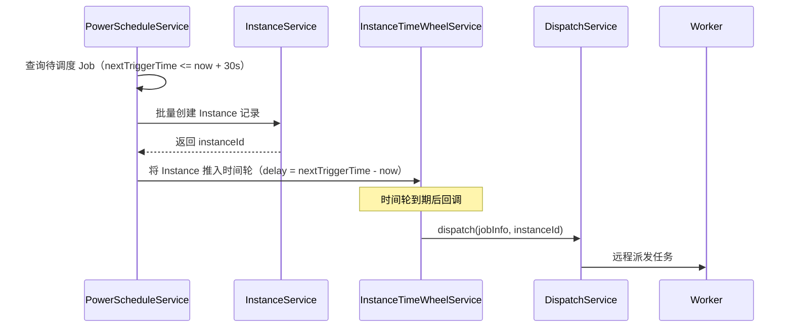
```mermaid
sequenceDiagram
    participant PS as PowerScheduleService
    participant IS as InstanceService
    participant TW as InstanceTimeWheelService
    participant DS as DispatchService
    participant W as Worker

    PS->>PS: 查询待调度 Job（nextTriggerTime <= now + 30s）
    PS->>IS: 批量创建 Instance 记录
    IS-->>PS: 返回 instanceId
    PS->>TW: 将 Instance 推入时间轮（delay = nextTriggerTime - now）
    Note over TW: 时间轮到期后回调
    TW->>DS: dispatch(jobInfo, instanceId)
    DS->>W: 远程派发任务
```

**2. 秒级任务调度（FIX_RATE / FIX_DELAY）**

秒级任务只创建一次 Instance，由 Worker 端的 FrequentTaskTracker 持续运行，不断产生 SubInstance。Server 端只检查该 Job 是否已有运行中的 Instance，没有则创建新的。

**3. 工作流调度**

与普通任务类似，但创建的是 WorkflowInstance，推入时间轮后回调 WorkflowInstanceManager.start()。

#### TimingStrategyService — 定时策略服务

[TimingStrategyService](file:///d:/workspace/java_projects/source_projects/PowerJob/powerjob-server/powerjob-server-core/src/main/java/tech/powerjob/server/core/scheduler/TimingStrategyService.java) 采用**策略模式**，通过 `TimingStrategyHandler` 接口支持多种时间表达式：

- `CronTimingStrategyHandler` — CRON 表达式
- `DailyTimeIntervalStrategyHandler` — 每日固定时间间隔
- `FixedRateTimingStrategyHandler` — 固定频率
- `FixedDelayTimingStrategyHandler` — 固定延迟
- `ApiTimingStrategyHandler` — API 触发
- `WorkflowTimingStrategyHandler` — 工作流触发

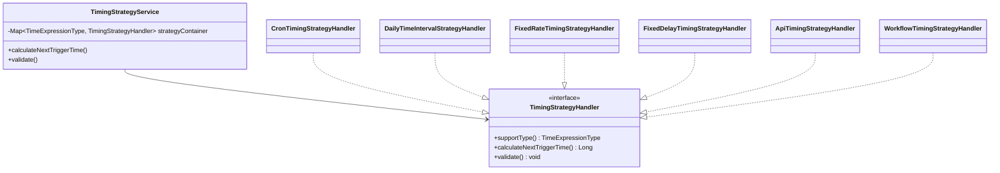
```mermaid
classDiagram
    class TimingStrategyService {
        -Map~TimeExpressionType, TimingStrategyHandler~ strategyContainer
        +calculateNextTriggerTime()
        +validate()
    }
    class TimingStrategyHandler {
        <<interface>>
        +supportType() TimeExpressionType
        +calculateNextTriggerTime() Long
        +validate() void
    }
    class CronTimingStrategyHandler
    class DailyTimeIntervalStrategyHandler
    class FixedRateTimingStrategyHandler
    class FixedDelayTimingStrategyHandler
    class ApiTimingStrategyHandler
    class WorkflowTimingStrategyHandler

    TimingStrategyService --> TimingStrategyHandler
    CronTimingStrategyHandler ..|> TimingStrategyHandler
    DailyTimeIntervalStrategyHandler ..|> TimingStrategyHandler
    FixedRateTimingStrategyHandler ..|> TimingStrategyHandler
    FixedDelayTimingStrategyHandler ..|> TimingStrategyHandler
    ApiTimingStrategyHandler ..|> TimingStrategyHandler
    WorkflowTimingStrategyHandler ..|> TimingStrategyHandler
```

### 2.3 DispatchService — 任务派发服务

[DispatchService](file:///d:/workspace/java_projects/source_projects/PowerJob/powerjob-server/powerjob-server-core/src/main/java/tech/powerjob/server/core/scheduler/DispatchService.java) 负责将任务从 Server 派发到 Worker，核心流程：

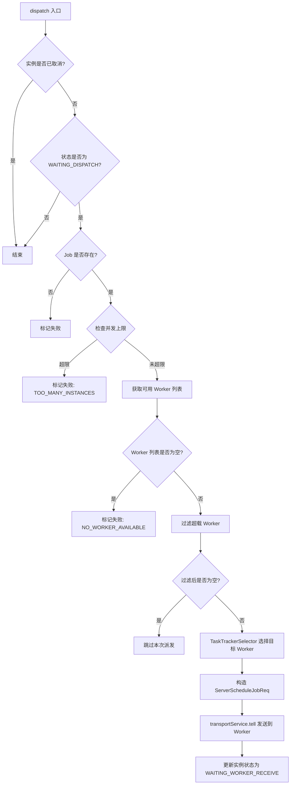
```mermaid
flowchart TD
    A[dispatch 入口] --> B{实例是否已取消?}
    B -->|是| C[结束]
    B -->|否| D{状态是否为 WAITING_DISPATCH?}
    D -->|否| C
    D -->|是| E{Job 是否存在?}
    E -->|否| F[标记失败]
    E -->|是| G{检查并发上限}
    G -->|超限| H[标记失败: TOO_MANY_INSTANCES]
    G -->|未超限| I[获取可用 Worker 列表]
    I --> J{Worker 列表是否为空?}
    J -->|是| K[标记失败: NO_WORKER_AVAILABLE]
    J -->|否| L[过滤超载 Worker]
    L --> M{过滤后是否为空?}
    M -->|是| N[跳过本次派发]
    M -->|否| O[TaskTrackerSelector 选择目标 Worker]
    O --> P[构造 ServerScheduleJobReq]
    P --> Q[transportService.tell 发送到 Worker]
    Q --> R[更新实例状态为 WAITING_WORKER_RECEIVE]
```

### 2.4 InstanceManager — 实例状态管理

[InstanceManager](file:///d:/workspace/java_projects/source_projects/PowerJob/powerjob-server/powerjob-server-core/src/main/java/tech/powerjob/server/core/instance/InstanceManager.java) 处理 Worker 上报的实例状态变更，核心逻辑：

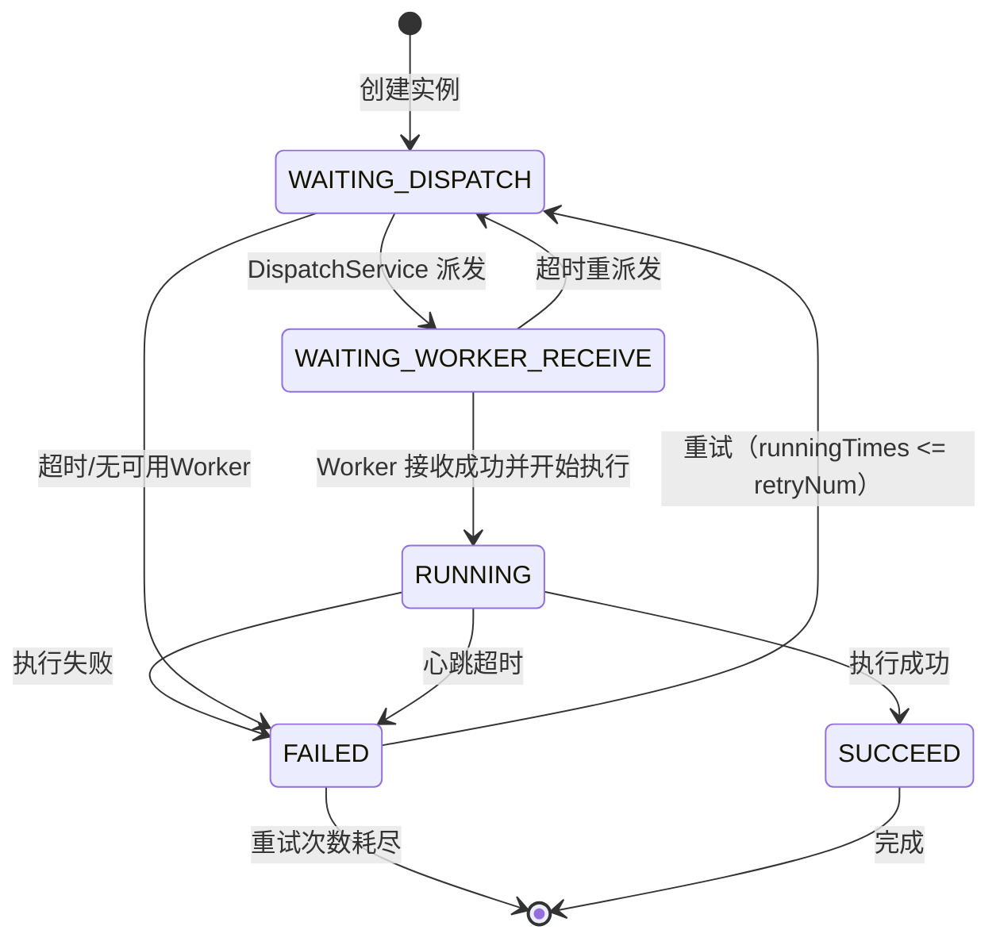
```mermaid
stateDiagram-v2
    [*] --> WAITING_DISPATCH: 创建实例
    WAITING_DISPATCH --> WAITING_WORKER_RECEIVE: DispatchService 派发
    WAITING_WORKER_RECEIVE --> RUNNING: Worker 接收成功并开始执行
    RUNNING --> SUCCEED: 执行成功
    RUNNING --> FAILED: 执行失败
    FAILED --> WAITING_DISPATCH: 重试（runningTimes <= retryNum）
    FAILED --> [*]: 重试次数耗尽
    SUCCEED --> [*]: 完成
    WAITING_DISPATCH --> FAILED: 超时/无可用Worker
    WAITING_WORKER_RECEIVE --> WAITING_DISPATCH: 超时重派发
    RUNNING --> FAILED: 心跳超时
```

### 2.5 InstanceStatusCheckService — 状态检查与故障恢复

[InstanceStatusCheckService](file:///d:/workspace/java_projects/source_projects/PowerJob/powerjob-server/powerjob-server-core/src/main/java/tech/powerjob/server/core/scheduler/InstanceStatusCheckService.java) 是系统**高可用的核心保障**，定期巡检各类异常状态：

| 检查项 | 超时阈值 | 处理策略 |
|--------|----------|----------|
| WAITING_DISPATCH | 30s | 重新派发（写入时间轮后 Server 宕机） |
| WAITING_WORKER_RECEIVE | 60s | 批量重置为 WAITING_DISPATCH（网络丢包） |
| RUNNING | 60s | 心跳超时，根据重试配置重试或标记失败 |
| Workflow WAITING | 60s | 重新启动工作流 |

---

## 三、Worker 端任务执行机制

### 3.1 Worker 启动流程

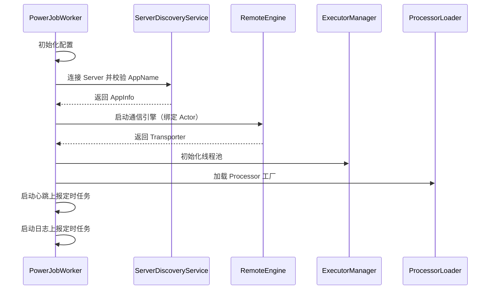
```mermaid
sequenceDiagram
    participant PW as PowerJobWorker
    participant SD as ServerDiscoveryService
    participant RE as RemoteEngine
    participant EM as ExecutorManager
    participant PL as ProcessorLoader

    PW->>PW: 初始化配置
    PW->>SD: 连接 Server 并校验 AppName
    SD-->>PW: 返回 AppInfo
    PW->>RE: 启动通信引擎（绑定 Actor）
    RE-->>PW: 返回 Transporter
    PW->>EM: 初始化线程池
    PW->>PL: 加载 Processor 工厂
    PW->>PW: 启动心跳上报定时任务
    PW->>PW: 启动日志上报定时任务
```

### 3.2 Actor 模型 — Worker 端消息处理

Worker 端使用 **Actor 模型**处理来自 Server 和内部的消息，定义了三个核心 Actor：

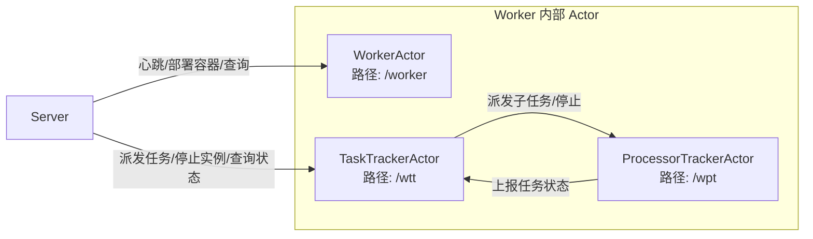
```mermaid
graph LR
    subgraph "Worker 内部 Actor"
        WA[WorkerActor<br/>路径: /worker]
        TTA[TaskTrackerActor<br/>路径: /wtt]
        PTA[ProcessorTrackerActor<br/>路径: /wpt]
    end

    Server -->|心跳/部署容器/查询| WA
    Server -->|派发任务/停止实例/查询状态| TTA
    TTA -->|派发子任务/停止| PTA
    PTA -->|上报任务状态| TTA
```

#### TaskTrackerActor — 任务跟踪器入口

[TaskTrackerActor](file:///d:/workspace/java_projects/source_projects/PowerJob/powerjob-worker/src/main/java/tech/powerjob/worker/actors/TaskTrackerActor.java) 是 Worker 端接收 Server 任务调度请求的入口，处理以下消息：

| Handler 路径 | 功能 | 请求类型 |
|-------------|------|----------|
| runJob | 接收 Server 派发的任务 | ServerScheduleJobReq |
| stopInstance | 停止任务实例 | ServerStopInstanceReq |
| queryInstanceStatus | 查询实例运行状态 | ServerQueryInstanceStatusReq |
| reportTaskStatus | Processor 上报子任务状态 | ProcessorReportTaskStatusReq |
| mapTask | MapReduce 的 Map 任务提交 | ProcessorMapTaskRequest |
| reportProcessorTrackerStatus | PT 心跳上报 | ProcessorTrackerStatusReportReq |

**轻量级 vs 重量级任务判断逻辑：**

```java
// 只有单机执行 + 非秒级任务才是轻量级
private boolean isLightweightTask(ServerScheduleJobReq req) {
    return ExecuteType.STANDALONE == executeType
        && timeExpressionType != FIXED_DELAY
        && timeExpressionType != FIXED_RATE;
}
```

### 3.3 TaskTracker 体系 — 两类任务模型

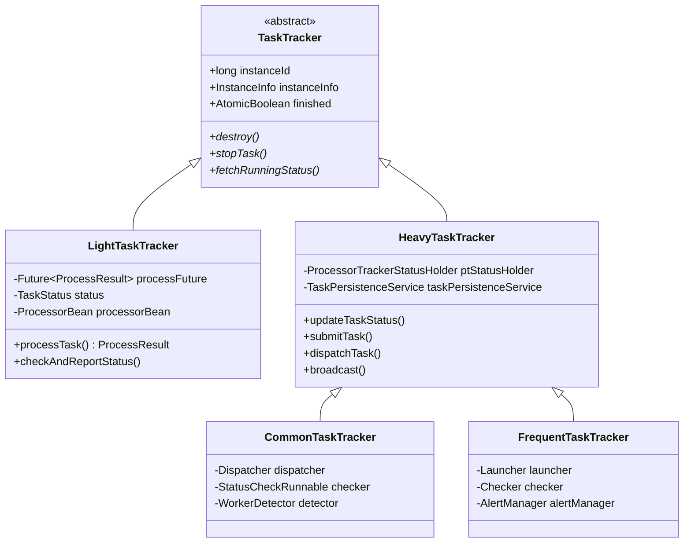
```mermaid
classDiagram
    class TaskTracker {
        <<abstract>>
        +long instanceId
        +InstanceInfo instanceInfo
        +AtomicBoolean finished
        +destroy()*
        +stopTask()*
        +fetchRunningStatus()*
    }
    class LightTaskTracker {
        -Future~ProcessResult~ processFuture
        -TaskStatus status
        -ProcessorBean processorBean
        +processTask() ProcessResult
        +checkAndReportStatus()
    }
    class HeavyTaskTracker {
        -ProcessorTrackerStatusHolder ptStatusHolder
        -TaskPersistenceService taskPersistenceService
        +updateTaskStatus()
        +submitTask()
        +dispatchTask()
        +broadcast()
    }
    class CommonTaskTracker {
        -Dispatcher dispatcher
        -StatusCheckRunnable checker
        -WorkerDetector detector
    }
    class FrequentTaskTracker {
        -Launcher launcher
        -Checker checker
        -AlertManager alertManager
    }

    TaskTracker <|-- LightTaskTracker
    TaskTracker <|-- HeavyTaskTracker
    HeavyTaskTracker <|-- CommonTaskTracker
    HeavyTaskTracker <|-- FrequentTaskTracker
```

#### LightTaskTracker — 轻量级任务

[LightTaskTracker](file:///d:/workspace/java_projects/source_projects/PowerJob/powerjob-worker/src/main/java/tech/powerjob/worker/core/tracker/task/light/LightTaskTracker.java) 适用于**单机执行的非秒级任务**，设计精简：

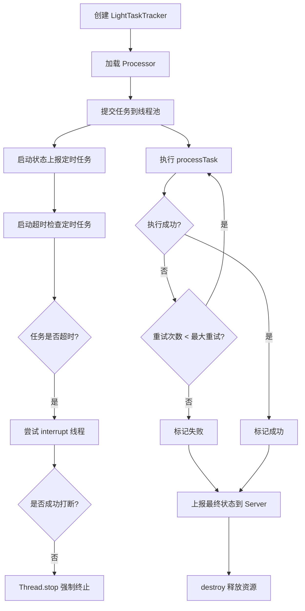
```mermaid
flowchart TD
    A[创建 LightTaskTracker] --> B[加载 Processor]
    B --> C[提交任务到线程池]
    C --> D[启动状态上报定时任务]
    D --> E[启动超时检查定时任务]
    
    E --> F{任务是否超时?}
    F -->|是| G[尝试 interrupt 线程]
    G --> H{是否成功打断?}
    H -->|否| I[Thread.stop 强制终止]
    
    C --> J[执行 processTask]
    J --> K{执行成功?}
    K -->|否| L{重试次数 < 最大重试?}
    L -->|是| J
    L -->|否| M[标记失败]
    K -->|是| N[标记成功]
    
    M --> O[上报最终状态到 Server]
    N --> O
    O --> P[destroy 释放资源]
```

#### HeavyTaskTracker — 重量级任务

[HeavyTaskTracker](file:///d:/workspace/java_projects/source_projects/PowerJob/powerjob-worker/src/main/java/tech/powerjob/worker/core/tracker/task/heavy/HeavyTaskTracker.java) 适用于**Map/MapReduce/广播/秒级**等复杂任务，采用**两级任务管理**：

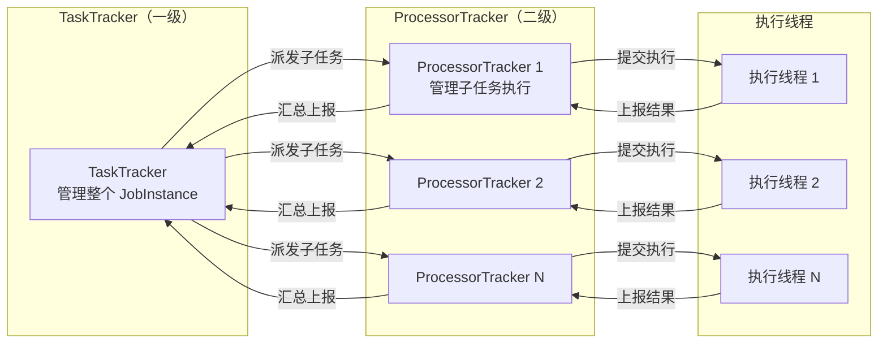
```mermaid
flowchart LR
    subgraph "TaskTracker（一级）"
        TT[TaskTracker<br/>管理整个 JobInstance]
    end
    
    subgraph "ProcessorTracker（二级）"
        PT1[ProcessorTracker 1<br/>管理子任务执行]
        PT2[ProcessorTracker 2]
        PT3[ProcessorTracker N]
    end
    
    subgraph "执行线程"
        E1[执行线程 1]
        E2[执行线程 2]
        E3[执行线程 N]
    end
    
    TT -->|派发子任务| PT1
    TT -->|派发子任务| PT2
    TT -->|派发子任务| PT3
    PT1 -->|提交执行| E1
    PT2 -->|提交执行| E2
    PT3 -->|提交执行| E3
    E1 -->|上报结果| PT1
    E2 -->|上报结果| PT2
    E3 -->|上报结果| PT3
    PT1 -->|汇总上报| TT
    PT2 -->|汇总上报| TT
    PT3 -->|汇总上报| TT
```

#### CommonTaskTracker — 普通重量级任务

[CommonTaskTracker](file:///d:/workspace/java_projects/source_projects/PowerJob/powerjob-worker/src/main/java/tech/powerjob/worker/core/tracker/task/heavy/CommonTaskTracker.java) 处理 API/CRON 触发的复杂任务，内部有三个核心组件：

- **Dispatcher**：定期扫描 WAITING_DISPATCH 状态的任务，派发给 ProcessorTracker
- **StatusCheckRunnable**：定期检查任务完成情况，判断是否需要创建 LastTask
- **WorkerDetector**：定期检测 ProcessorTracker 集群变化（用于 MR 任务动态扩缩容）

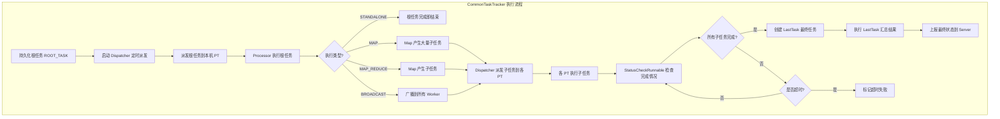
```mermaid
flowchart TD
    subgraph "CommonTaskTracker 执行流程"
        A[持久化根任务 ROOT_TASK] --> B[启动 Dispatcher 定时派发]
        B --> C[派发根任务到本机 PT]
        C --> D[Processor 执行根任务]
        D --> E{执行类型?}
        
        E -->|STANDALONE| F[根任务完成即结束]
        E -->|MAP| G[Map 产生大量子任务]
        E -->|MAP_REDUCE| H[Map 产生子任务]
        E -->|BROADCAST| I[广播到所有 Worker]
        
        G --> J[Dispatcher 派发子任务到各 PT]
        H --> J
        I --> J
        
        J --> K[各 PT 执行子任务]
        K --> L[StatusCheckRunnable 检查完成情况]
        
        L --> M{所有子任务完成?}
        M -->|是| N[创建 LastTask 最终任务]
        N --> O[执行 LastTask 汇总结果]
        O --> P[上报最终状态到 Server]
        
        M -->|否| Q{是否超时?}
        Q -->|是| R[标记超时失败]
        Q -->|否| L
    end
```

#### FrequentTaskTracker — 秒级任务

[FrequentTaskTracker](file:///d:/workspace/java_projects/source_projects/PowerJob/powerjob-worker/src/main/java/tech/powerjob/worker/core/tracker/task/heavy/FrequentTaskTracker.java) 处理 FIX_RATE/FIX_DELAY 秒级任务，特点：

- **Launcher**：按固定频率发射 SubInstance（子实例），每个 SubInstance 独立执行
- **Checker**：定期检查 SubInstance 完成情况，超时直接失败（不重试）
- **AlertManager**：滑动窗口告警统计，支持沉默窗口
- **LRUCache**：保存最近 10 个 SubInstance 信息供查询

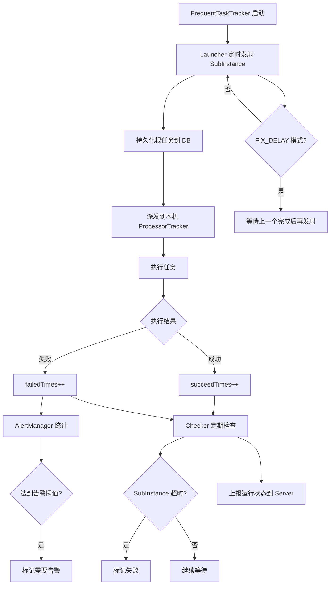
```mermaid
flowchart TD
    A[FrequentTaskTracker 启动] --> B[Launcher 定时发射 SubInstance]
    B --> C[持久化根任务到 DB]
    C --> D[派发到本机 ProcessorTracker]
    D --> E[执行任务]
    E --> F{执行结果}
    F -->|成功| G[succeedTimes++]
    F -->|失败| H[failedTimes++]
    H --> I[AlertManager 统计]
    I --> J{达到告警阈值?}
    J -->|是| K[标记需要告警]
    
    G --> L[Checker 定期检查]
    H --> L
    L --> M{SubInstance 超时?}
    M -->|是| N[标记失败]
    M -->|否| O[继续等待]
    
    L --> P[上报运行状态到 Server]
    
    B --> Q{FIX_DELAY 模式?}
    Q -->|是| R[等待上一个完成后再发射]
    Q -->|否| B
```

---

## 四、通信层 — 可插拔远程调用框架

### 4.1 架构设计

PowerJob 的通信层采用**可插拔架构**，通过 SPI 机制支持多种通信协议：

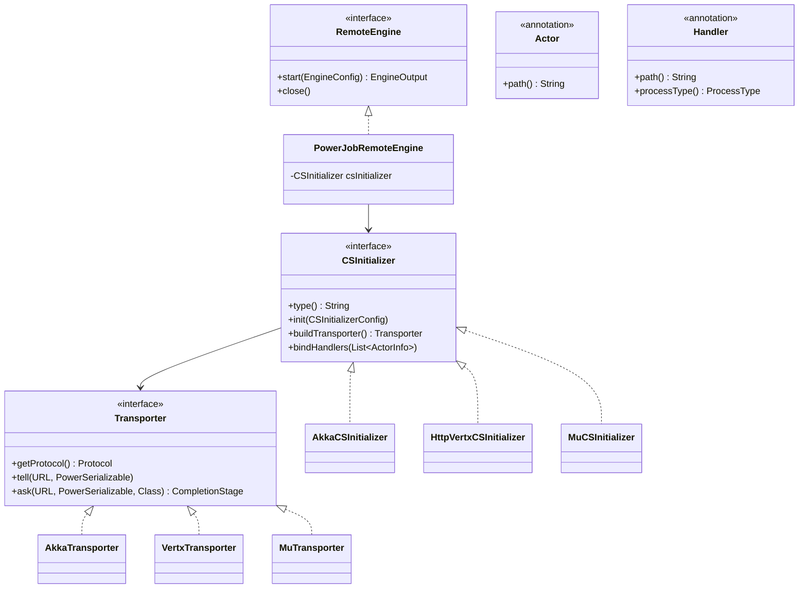
```mermaid
classDiagram
    class RemoteEngine {
        <<interface>>
        +start(EngineConfig) EngineOutput
        +close()
    }
    class CSInitializer {
        <<interface>>
        +type() String
        +init(CSInitializerConfig)
        +buildTransporter() Transporter
        +bindHandlers(List~ActorInfo~)
    }
    class Transporter {
        <<interface>>
        +getProtocol() Protocol
        +tell(URL, PowerSerializable)
        +ask(URL, PowerSerializable, Class) CompletionStage
    }
    class Actor {
        <<annotation>>
        +path() String
    }
    class Handler {
        <<annotation>>
        +path() String
        +processType() ProcessType
    }

    class PowerJobRemoteEngine {
        -CSInitializer csInitializer
    }
    class AkkaCSInitializer
    class HttpVertxCSInitializer
    class MuCSInitializer
    class AkkaTransporter
    class VertxTransporter
    class MuTransporter

    RemoteEngine <|.. PowerJobRemoteEngine
    CSInitializer <|.. AkkaCSInitializer
    CSInitializer <|.. HttpVertxCSInitializer
    CSInitializer <|.. MuCSInitializer
    Transporter <|.. AkkaTransporter
    Transporter <|.. VertxTransporter
    Transporter <|.. MuTransporter

    PowerJobRemoteEngine --> CSInitializer
    CSInitializer --> Transporter
```

### 4.2 Actor + Handler 注解驱动模型

通信层使用**注解驱动的 Actor 模型**，通过 `@Actor` 和 `@Handler` 注解声明式定义消息处理器：

```java
// Server 端处理 Worker 请求
@Actor(path = "/server/worker")
public class WorkerRequestHandlerImpl {
    
    @Handler(path = "heartbeat", processType = ProcessType.NO_BLOCKING)
    public void processWorkerHeartbeat(WorkerHeartbeat heartbeat) { ... }
    
    @Handler(path = "reportInstanceStatus", processType = ProcessType.BLOCKING)
    public AskResponse processTaskTrackerReportInstanceStatus(...) { ... }
}

// Worker 端处理 Server 请求
@Actor(path = "/wtt")
public class TaskTrackerActor {
    
    @Handler(path = "runJob")
    public void onReceiveServerScheduleJobReq(ServerScheduleJobReq req) { ... }
}
```

### 4.3 通信流程

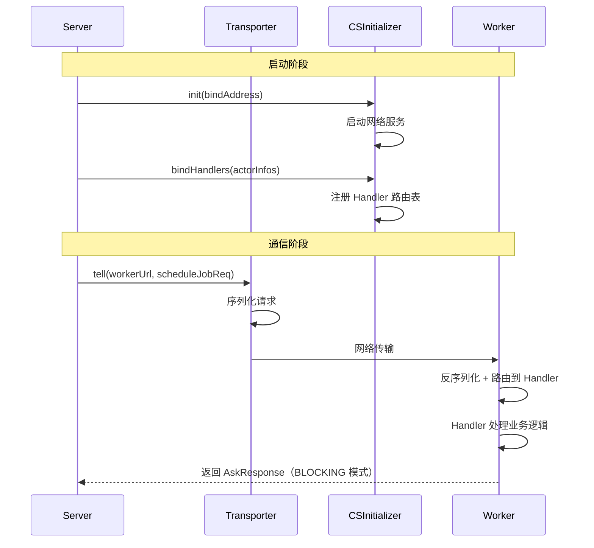
```mermaid
sequenceDiagram
    participant S as Server
    participant T as Transporter
    participant CS as CSInitializer
    participant W as Worker

    Note over S,W: 启动阶段
    S->>CS: init(bindAddress)
    CS->>CS: 启动网络服务
    S->>CS: bindHandlers(actorInfos)
    CS->>CS: 注册 Handler 路由表

    Note over S,W: 通信阶段
    S->>T: tell(workerUrl, scheduleJobReq)
    T->>T: 序列化请求
    T->>W: 网络传输
    W->>W: 反序列化 + 路由到 Handler
    W->>W: Handler 处理业务逻辑
    W-->>S: 返回 AskResponse（BLOCKING 模式）
```

---

## 五、工作流引擎深度分析

### 5.1 DAG 数据结构

PowerJob 的工作流使用 **DAG（有向无环图）** 描述任务依赖关系：

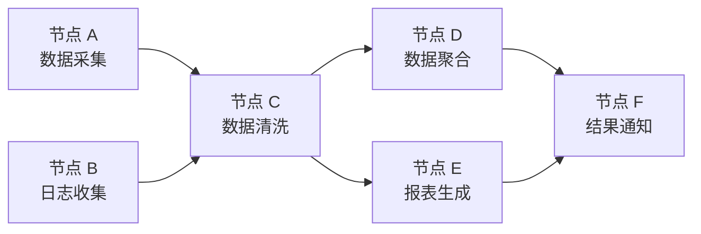
```mermaid
graph LR
    A[节点 A<br/>数据采集] --> C[节点 C<br/>数据清洗]
    B[节点 B<br/>日志收集] --> C
    C --> D[节点 D<br/>数据聚合]
    C --> E[节点 E<br/>报表生成]
    D --> F[节点 F<br/>结果通知]
    E --> F
```

DAG 支持两种表示法：
- **PEWorkflowDAG**（点线表示法）：`{nodes: [...], edges: [{from, to}]}` — 用于 JSON 序列化存储
- **WorkflowDAG**（引用表示法）：节点持有上下游引用 — 用于内存中的高效遍历

### 5.2 工作流实例生命周期

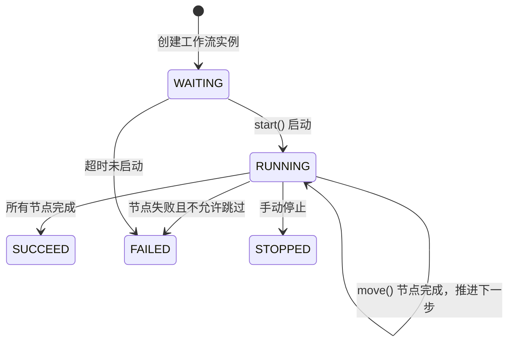
```mermaid
stateDiagram-v2
    [*] --> WAITING: 创建工作流实例
    WAITING --> RUNNING: start() 启动
    RUNNING --> RUNNING: move() 节点完成，推进下一步
    RUNNING --> SUCCEED: 所有节点完成
    RUNNING --> FAILED: 节点失败且不允许跳过
    RUNNING --> STOPPED: 手动停止
    WAITING --> FAILED: 超时未启动
```

### 5.3 工作流执行引擎

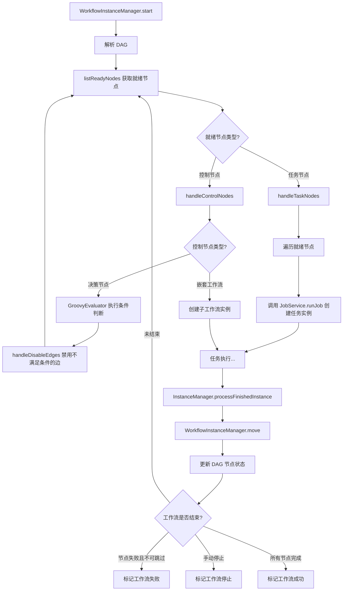
```mermaid
flowchart TD
    A[WorkflowInstanceManager.start] --> B[解析 DAG]
    B --> C[listReadyNodes 获取就绪节点]
    C --> D{就绪节点类型?}
    
    D -->|控制节点| E[handleControlNodes]
    E --> F{控制节点类型?}
    F -->|决策节点| G[GroovyEvaluator 执行条件判断]
    G --> H[handleDisableEdges 禁用不满足条件的边]
    F -->|嵌套工作流| I[创建子工作流实例]
    
    D -->|任务节点| J[handleTaskNodes]
    J --> K[遍历就绪节点]
    K --> L[调用 JobService.runJob 创建任务实例]
    L --> M[任务执行...]
    
    M --> N[InstanceManager.processFinishedInstance]
    N --> O[WorkflowInstanceManager.move]
    O --> P[更新 DAG 节点状态]
    P --> Q{工作流是否结束?}
    
    Q -->|节点失败且不可跳过| R[标记工作流失败]
    Q -->|手动停止| S[标记工作流停止]
    Q -->|所有节点完成| T[标记工作流成功]
    Q -->|未结束| C
    
    H --> C
    I --> M
```

### 5.4 工作流节点类型

| 节点类型 | 说明 | 处理器 |
|---------|------|--------|
| JOB | 普通任务节点 | JobNodeHandler |
| DECISION | 决策节点（条件分支） | DecisionNodeHandler |
| NESTED_WORKFLOW | 嵌套工作流节点 | NestedWorkflowNodeHandler |

### 5.5 DAG 校验与就绪节点计算

[WorkflowDAGUtils](file:///d:/workspace/java_projects/source_projects/PowerJob/powerjob-server/powerjob-server-core/src/main/java/tech/powerjob/server/core/workflow/algorithm/WorkflowDAGUtils.java) 提供了完整的 DAG 算法：

- **valid()**：DFS 遍历检测环，确保 DAG 合法性
- **listReadyNodes()**：计算当前可执行的节点（所有前驱节点均已完成）
- **handleDisableEdges()**：决策节点分支选择后，禁用不满足条件的路径
- **isNotAllowSkipWhenFailed()**：判断节点失败时是否允许跳过

---

## 六、设计亮点总结

### 6.1 无锁化调度设计

传统调度框架（Quartz、XXL-JOB）依赖数据库行锁实现调度互斥，存在性能瓶颈。PowerJob 采用**应用级分片 + 无锁调度**：

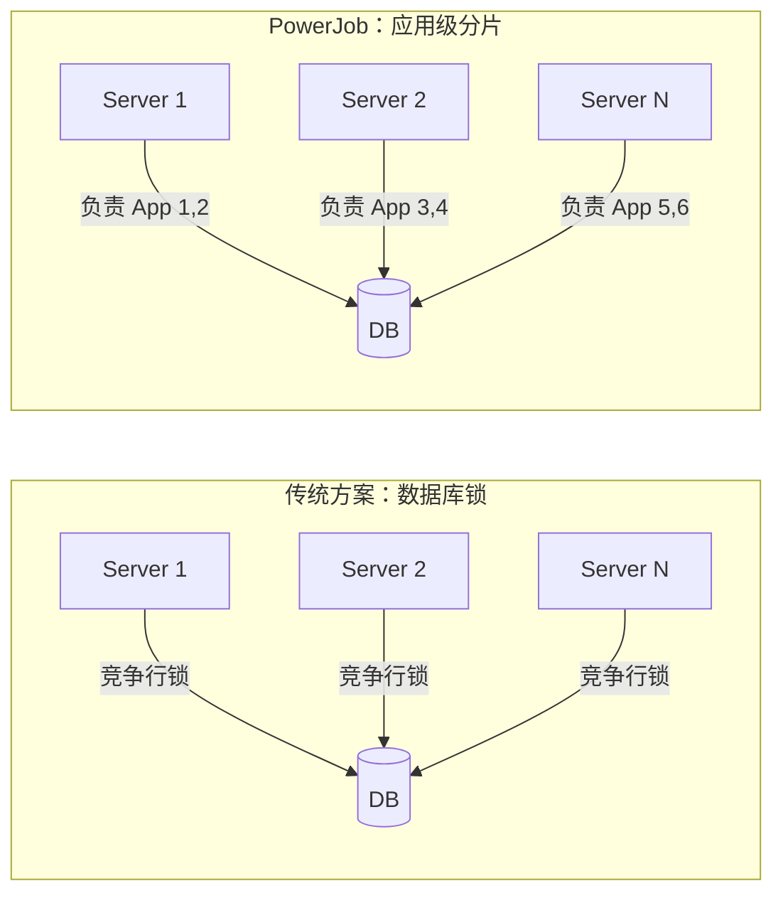
```mermaid
flowchart LR
    subgraph "传统方案：数据库锁"
        A1[Server 1] -->|竞争行锁| DB1[(DB)]
        A2[Server 2] -->|竞争行锁| DB1
        A3[Server N] -->|竞争行锁| DB1
    end

    subgraph "PowerJob：应用级分片"
        B1[Server 1] -->|负责 App 1,2| DB2[(DB)]
        B2[Server 2] -->|负责 App 3,4| DB2
        B3[Server N] -->|负责 App 5,6| DB2
    end
```

每个 Server 只调度自己负责的 App 下的任务，通过 `appInfoRepository.listAppIdByCurrentServer()` 查询，天然避免了调度冲突。

### 6.2 时间轮定时器

[HasheldWheelTimer](file:///d:/workspace/java_projects/source_projects/PowerJob/powerjob-server/powerjob-server-common/src/main/java/tech/powerjob/server/common/timewheel/HashedWheelTimer.java) 是自研的高性能时间轮实现：

- 将定时任务按过期时间散列到不同的槽位（Bucket）
- 指针每 tick 移动一格，处理当前槽位的到期任务
- 支持任务取消、线程池异步执行
- 用于替代大量 ScheduledExecutorService，减少线程开销

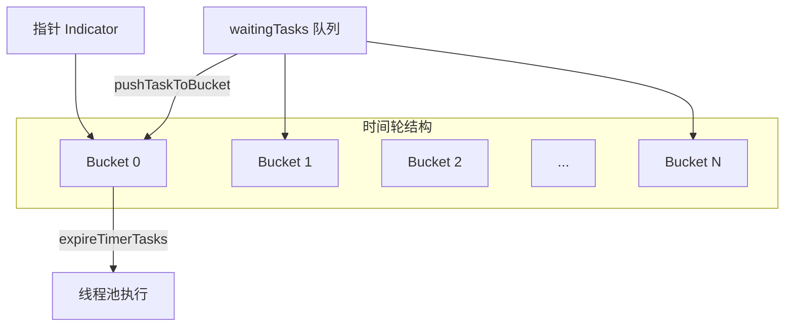
```mermaid
flowchart TD
    subgraph "时间轮结构"
        direction LR
        B0[Bucket 0]
        B1[Bucket 1]
        B2[Bucket 2]
        B3[...]
        BN[Bucket N]
    end

    P[指针 Indicator] --> B0
    Q[waitingTasks 队列] -->|pushTaskToBucket| B0
    Q --> B1
    Q --> BN

    B0 -->|expireTimerTasks| E[线程池执行]
```

### 6.3 分段锁与缓存锁

- **SegmentLock**：基于 `hashCode % concurrencyLevel` 分段，减少锁竞争。用于 TaskTracker 中子任务状态更新的并发控制。
- **@UseCacheLock**：基于 Spring Cache + SpEL 表达式的声明式缓存锁，用于 DispatchService 和 WorkflowInstanceManager 的并发控制，防止同一实例被重复派发。

### 6.4 轻量级/重量级双任务模型

| 特性 | LightTaskTracker | HeavyTaskTracker |
|------|-----------------|------------------|
| 适用场景 | 单机非秒级任务 | Map/MapReduce/广播/秒级 |
| 任务模型 | 单层（直接执行） | 两层（TT → PT → 执行） |
| 持久化 | 无需 | 需要（子任务持久化到 DB） |
| 资源开销 | 低 | 高 |
| 故障恢复 | 简单重试 | 子任务级重试 + PT 心跳检测 |

### 6.5 可插拔通信框架

通过 `CSInitializer` 接口抽象，支持三种通信实现：
- **Akka**：基于 Akka Actor 模型，适合高并发场景
- **HTTP/Vertx**：基于 Vert.x，无额外依赖
- **Mu**：自研实现，无第三方依赖，最轻量

### 6.6 容器化处理器部署

支持通过 WebSocket 将 FatJar 或 Git 源码构建的 Jar 包部署到 Worker：

```mermaid
sequenceDiagram
    participant UI as Web 控制台
    participant S as Server
    participant DFS as 文件存储
    participant W1 as Worker 1
    participant W2 as Worker 2

    UI->>S: 上传 Jar / 配置 Git 仓库
    S->>S: Git Clone + Maven Build（或直接使用 Jar）
    S->>DFS: 上传 Jar 到分布式存储
    S->>W1: WebSocket 通知部署
    S->>W2: WebSocket 通知部署
    W1->>S: HTTP 下载 Jar
    W2->>S: HTTP 下载 Jar
    W1->>W1: 加载 Jar，创建 OmsJarContainer
    W2->>W2: 加载 Jar，创建 OmsJarContainer
```

Worker 端使用自定义 ClassLoader（`OhMyClassLoader`）加载容器 Jar，支持热部署和版本切换。

### 6.7 秒级任务告警机制

FrequentTaskTracker 内置 `AlertManager`，使用**滑动窗口 + 沉默窗口**机制：

- **统计窗口**：统计最近 N 秒内的失败次数
- **告警阈值**：失败次数达到阈值触发告警
- **沉默窗口**：告警后一段时间内不再重复告警

### 6.8 多级故障恢复机制

```
Level 1: 子任务级重试（taskRetryNum）
    └── ProcessorTracker 执行失败 → TaskTracker 重新派发

Level 2: 实例级重试（instanceRetryNum）
    └── TaskTracker 心跳超时 → Server 重新派发整个实例

Level 3: 状态检查兜底
    └── InstanceStatusCheckService 定时巡检
        ├── WAITING_DISPATCH 超时 → 重新派发
        ├── WAITING_WORKER_RECEIVE 超时 → 重新派发
        └── RUNNING 超时 → 重试或标记失败
```

---

## 七、核心流程全景图

### 7.1 任务完整生命周期

```mermaid
flowchart TD
    subgraph "1. 调度阶段 - Server"
        A[定时调度线程触发] --> B[查询待调度 Job]
        B --> C[创建 Instance]
        C --> D[推入时间轮]
        D --> E[时间轮到期]
        E --> F[筛选可用 Worker]
        F --> G[选择 TaskTracker 节点]
        G --> H[远程派发]
    end

    subgraph "2. 接收阶段 - Worker"
        H --> I[TaskTrackerActor 接收]
        I --> J{任务类型?}
        J -->|轻量级| K[创建 LightTaskTracker]
        J -->|重量级| L[创建 HeavyTaskTracker]
    end

    subgraph "3. 执行阶段 - Worker"
        K --> M[直接执行 Processor]
        L --> N[持久化根任务]
        N --> O[Dispatcher 派发子任务]
        O --> P[ProcessorTracker 执行]
        P --> Q[上报子任务结果]
        Q --> R{所有子任务完成?}
        R -->|是| S[执行 LastTask]
        R -->|否| O
        S --> T[汇总最终结果]
        M --> T
    end

    subgraph "4. 完成阶段 - Server"
        T --> U[上报最终状态到 Server]
        U --> V[InstanceManager 处理]
        V --> W{是否需要重试?}
        W -->|是| F
        W -->|否| X[标记最终状态]
        X --> Y{关联工作流?}
        Y -->|是| Z[WorkflowInstanceManager.move]
        Y -->|否| END[结束]
        Z --> END
    end
```

### 7.2 Server 集群协作

```mermaid
flowchart TD
    subgraph "Server 集群"
        S1[Server 1<br/>负责 App 1,2,3]
        S2[Server 2<br/>负责 App 4,5,6]
        S3[Server 3<br/>负责 App 7,8,9]
    end

    subgraph "Worker 集群"
        W1[Worker A<br/>App 1]
        W2[Worker B<br/>App 1]
        W3[Worker C<br/>App 4]
        W4[Worker D<br/>App 4]
    end

    S1 -->|心跳| W1
    S1 -->|心跳| W2
    S2 -->|心跳| W3
    S2 -->|心跳| W4

    S1 -->|派发 App1 任务| W1
    S1 -->|派发 App1 任务| W2
    S2 -->|派发 App4 任务| W3
    S2 -->|派发 App4 任务| W4
```

---

## 八、总结

PowerJob 是一个设计精良的分布式任务调度框架，其核心设计思想包括：

1. **无锁化调度**：通过应用级分片避免数据库锁竞争，支持 Server 无限水平扩展
2. **时间轮**：高效管理海量定时任务，替代传统 ScheduledExecutorService
3. **Actor 模型**：Worker 端使用 Actor 模式处理消息，逻辑清晰，天然支持并发
4. **双任务模型**：轻量级/重量级分离，兼顾简单任务的低开销和复杂任务的分布式能力
5. **可插拔通信层**：支持 Akka/HTTP/Mu 多种协议，适应不同部署环境
6. **DAG 工作流**：支持条件分支、嵌套子工作流、失败跳过等高级编排能力
7. **多级故障恢复**：子任务级→实例级→状态检查兜底，层层保障任务最终一致性
8. **容器化部署**：支持动态加载 Jar 包，实现处理器热部署

---

## 九、时间轮实现深度剖析

PowerJob 的时间轮是一个自研的高性能定时任务调度器，核心类在 [HashedWheelTimer](file:///d:/workspace/java_projects/source_projects/PowerJob/powerjob-server/powerjob-server-common/src/main/java/tech/powerjob/server/common/timewheel/HashedWheelTimer.java)，整体设计参考了 Netty 的 `HashedWheelTimer`，用于替代大量 `ScheduledExecutorService`，高效管理海量定时任务。

### 9.1 整体架构

```mermaid
flowchart TB
    subgraph "外部调用"
        A["schedule(task, delay)"]
    end

    subgraph "HashedWheelTimer"
        direction TB
        B["waitingTasks 等待队列<br/>LinkedBlockingQueue"]
        C["canceledTasks 取消队列"]
        D["Indicator 指针线程<br/>单线程循环"]
        E["时间轮 wheel<br/>HashedWheelBucket[]"]
        F["taskProcessPool<br/>执行线程池"]
    end

    A -->|"delay > 0"| B
    A -->|"delay <= 0"| F
    D -->|"1. pushTaskToBucket"| B
    D -->|"2. processCanceledTasks"| C
    D -->|"3. tickTack 等待"| D
    D -->|"4. expireTimerTasks"| E
    E -->|"到期任务"| F
```

### 9.2 核心数据结构

#### 9.2.1 时间轮数组

轮盘大小会被格式化为 2 的 N 次方，这样可以用 `& mask` 代替 `%` 取余，位运算效率远高于取模：

```java
// 例：输入 1000 → 输出 1024
int ticksNum = CommonUtils.formatSize(ticksPerWheel);
wheel = new HashedWheelBucket[ticksNum];
mask = wheel.length - 1;  // 如 4095，二进制全是 1
```

`formatSize` 使用经典的位运算将任意整数向上取整为 2 的幂（与 HashMap 的 `tableSizeFor` 同款算法）：

```java
public static int formatSize(int cap) {
    int n = cap - 1;
    n |= n >>> 1;
    n |= n >>> 2;
    n |= n >>> 4;
    n |= n >>> 8;
    n |= n >>> 16;
    return (n < 0) ? 1 : n + 1;
}
```

#### 9.2.2 Bucket — 时间格

每个 Bucket 本质是一个 `LinkedList<HashedWheelTimerFuture>`，存储散列到同一槽位的所有任务：

```java
private final class HashedWheelBucket extends LinkedList<HashedWheelTimerFuture> {
    public void expireTimerTasks(long currentTick) {
        removeIf(timerFuture -> {
            // 已取消的移除
            if (timerFuture.status == CANCELED) return true;
            // 本轮到期：totalTicks <= currentTick
            if (timerFuture.totalTicks <= currentTick) {
                runTask(timerFuture);
                timerFuture.status = FINISHED;
                return true;  // 从链表中移除
            }
            return false;  // 还没到，保留在链表中下次再判断
        });
    }
}
```

#### 9.2.3 HashedWheelTimerFuture — 任务包装

```java
private final class HashedWheelTimerFuture implements TimerFuture {
    private final long targetTime;      // 预期执行的绝对时间戳
    private final TimerTask timerTask;  // 实际要执行的任务
    private HashedWheelBucket bucket;   // 所属时间格引用（用于快速取消）
    private long totalTicks;            // 需要走的总 tick 数
    private int status;                 // WAITING(0) / RUNNING(1) / FINISHED(2) / CANCELED(3)
}
```

### 9.3 核心运行流程

#### 9.3.1 Indicator 指针线程 — 时间轮的心脏

```mermaid
flowchart TD
    A["Indicator.run 循环"] --> B["1. pushTaskToBucket<br/>将等待队列的任务推入时间轮"]
    B --> C["2. processCanceledTasks<br/>处理取消队列中的任务"]
    C --> D["3. tickTack<br/>Thread.sleep 等待指针跳到下一刻"]
    D --> E["4. expireTimerTasks<br/>执行当前槽位的到期任务"]
    E --> F["tick++"]
    F -->|未停止| A
    F -->|已停止| G[结束]
```

#### 9.3.2 任务入轮 — pushTaskToBucket

```java
private void pushTaskToBucket() {
    while (true) {
        HashedWheelTimerFuture timerTask = waitingTasks.poll();
        if (timerTask == null) return;

        // 计算总偏移量（毫秒）
        long offset = timerTask.targetTime - startTime;
        // 计算需要走的总 tick 数
        timerTask.totalTicks = offset / tickDuration;
        // 用 & mask 代替 % 取余，计算落入哪个槽位
        int index = (int) (timerTask.totalTicks & mask);
        HashedWheelBucket bucket = wheel[index];

        // 保存 bucket 引用，用于后续取消
        timerTask.bucket = bucket;
        bucket.add(timerTask);
    }
}
```

**关键点**：任务不是按到期时间精确排序的，而是按 `totalTicks & mask` 散列到不同槽位。同一个槽位可能有不同圈数的任务，通过 `totalTicks <= currentTick` 判断是否真正到期。

#### 9.3.3 到期判断 — expireTimerTasks

**举例**：假设 `tickDuration=1ms`，轮盘大小 4096：

- 任务 A 延迟 100ms → `totalTicks=100`，落入 `index = 100 & 4095 = 100`
- 任务 B 延迟 4196ms → `totalTicks=4196`，落入 `index = 4196 & 4095 = 100`（**同一个槽位！**）
- 当 `currentTick=100` 时，A 到期执行，B 因为 `4196 > 100` 保留
- 当 `currentTick=4196` 时（指针转了约 1 圈多），B 到期执行

```mermaid
flowchart LR
    subgraph "tick=100 时"
        S1["Bucket[100]"]
        S1 --> T1["任务A: totalTicks=100 ✅ 到期"]
        S1 --> T2["任务B: totalTicks=4196 ❌ 保留"]
    end

    subgraph "tick=4196 时（指针转了1圈多）"
        S2["Bucket[100]"]
        S2 --> T3["任务B: totalTicks=4196 ✅ 到期"]
    end
```

#### 9.3.4 任务取消 — cancel

```java
public boolean cancel() {
    if (status == WAITING) {
        status = CANCELED;
        canceledTasks.add(this);  // 加入取消队列
        return true;
    }
    return false;
}
```

Indicator 线程在每轮循环的第二步 `processCanceledTasks()` 中处理取消队列，从对应 Bucket 链表中 O(1) 移除任务：

```java
private void processCanceledTasks() {
    while (true) {
        HashedWheelTimerFuture canceledTask = canceledTasks.poll();
        if (canceledTask == null) return;
        // 从链表中删除（bucket 为 null 说明还没推入时间格）
        if (canceledTask.bucket != null) {
            canceledTask.bucket.remove(canceledTask);
        }
    }
}
```

#### 9.3.5 任务执行 — runTask

```java
private void runTask(HashedWheelTimerFuture timerFuture) {
    timerFuture.status = RUNNING;
    if (taskProcessPool == null) {
        timerFuture.timerTask.run();  // 直接在 Indicator 线程执行
    } else {
        taskProcessPool.submit(timerFuture.timerTask);  // 提交到线程池异步执行
    }
}
```

### 9.4 双层时间轮设计

[InstanceTimeWheelService](file:///d:/workspace/java_projects/source_projects/PowerJob/powerjob-server/powerjob-server-common/src/main/java/tech/powerjob/server/common/timewheel/holder/InstanceTimeWheelService.java) 封装了两层时间轮，解决长延迟任务占用精确时间轮资源的问题：

```mermaid
flowchart LR
    A["schedule 调用"] --> B{"delay > 60s?"}
    B -->|否| C["精确时间轮 TIMER<br/>tick=1ms, 4096格<br/>精度高，适合短延迟"]
    B -->|是| D["粗粒度时间轮 SLOW_TIMER<br/>tick=10s, 12格<br/>先等 delay-60s"]
    D --> E["剩余 ≤60s 时<br/>转投精确时间轮"]
    E --> C
```

```java
// 精确时间轮：1ms 精度，4096 格，多线程执行
private static final Timer TIMER = new HashedWheelTimer(1, 4096, cpuCores * 4);

// 粗粒度时间轮：10s 精度，12 格，单线程执行
private static final Timer SLOW_TIMER = new HashedWheelTimer(10000, 12, 0);

public static void schedule(Long uniqueId, Long delayMS, TimerTask timerTask) {
    if (delayMS <= 60000) {
        // 短延迟：直接用精确时间轮
        realSchedule(uniqueId, delayMS, timerTask);
    } else {
        // 长延迟：先用粗粒度时间轮等大部分时间，剩余 60s 内再转精确时间轮
        long expectTriggerTime = System.currentTimeMillis() + delayMS;
        SLOW_TIMER.schedule(() -> {
            CARGO.remove(uniqueId);
            realSchedule(uniqueId, expectTriggerTime - System.currentTimeMillis(), timerTask);
        }, delayMS - 60000, TimeUnit.MILLISECONDS);
    }
}
```

**为什么需要双层？** 如果所有长延迟任务（如延迟 1 小时）都放入 1ms 精度的时间轮，会导致：

1. `totalTicks` 值巨大（3,600,000），每次 `expireTimerTasks` 都要遍历判断
2. 槽位中堆积大量未到期任务，链表变长，遍历开销增大

### 9.5 在 PowerJob 调度中的实际应用

时间轮在调度流程中的位置：

```mermaid
sequenceDiagram
    participant PS as PowerScheduleService
    participant IS as InstanceService
    participant TW as InstanceTimeWheelService
    participant HT as HashedWheelTimer
    participant DS as DispatchService

    PS->>IS: 创建 Instance（nextTriggerTime = 未来某时刻）
    IS-->>PS: instanceId
    PS->>TW: schedule(instanceId, delay, () -> dispatchService.dispatch(...))
    Note over TW: delay = nextTriggerTime - now
    TW->>HT: schedule(task, delay, MILLISECONDS)
    HT->>HT: pushTaskToBucket 推入对应槽位
    Note over HT: 时间流逝...指针转动...
    HT->>HT: expireTimerTasks 到期触发
    HT->>DS: dispatchService.dispatch(jobInfo, instanceId)
    DS->>DS: 派发任务到 Worker
```

实际调用代码（[PowerScheduleService](file:///d:/workspace/java_projects/source_projects/PowerJob/powerjob-server/powerjob-server-core/src/main/java/tech/powerjob/server/core/scheduler/PowerScheduleService.java)）：

```java
long targetTriggerTime = jobInfoDO.getNextTriggerTime();
long delay = targetTriggerTime - nowTime;
InstanceTimeWheelService.schedule(instanceId, delay, () ->
    dispatchService.dispatch(jobInfoDO, instanceId, Optional.empty(), Optional.empty())
);
```

### 9.6 时间轮设计亮点总结

| 设计点 | 说明 |
|--------|------|
| **2 的 N 次方槽位** | `& mask` 代替 `%` 取余，位运算效率远高于取模 |
| **无锁化入队** | 使用 `LinkedBlockingQueue` 做生产者-消费者分离，`schedule()` 多线程并发安全 |
| **单线程指针** | Indicator 单线程串行处理，无需加锁，避免并发复杂度 |
| **O(1) 取消** | 通过 `bucket` 引用直接从链表中删除，不需要遍历整个时间轮 |
| **双层时间轮** | 长延迟任务先用粗粒度时间轮，避免占用精确时间轮资源 |
| **线程池异步执行** | 到期任务提交到线程池执行，不阻塞指针转动 |
| **延迟 ≤0 直接执行** | 已过期任务不走时间轮，直接提交执行 |
| **支持取消** | 通过 `canceledTasks` 队列 + `bucket` 引用实现高效取消 |

---

## 十、无锁化调度实现深度剖析

传统调度框架（Quartz、XXL-JOB）依赖数据库行锁（`SELECT ... FOR UPDATE`）来保证多个调度服务器不会重复调度同一个任务，但这带来了严重的性能瓶颈——所有服务器竞争同一把数据库锁，调度能力无法水平扩展。

PowerJob 另辟蹊径，通过 **应用级分片 + Server 选举 + 本地缓存锁** 三层机制实现了真正的无锁化调度。

### 10.1 整体架构对比

```mermaid
flowchart LR
    subgraph "传统方案：数据库行锁"
        direction TB
        S1[Server 1] -->|"SELECT ... FOR UPDATE<br/>竞争行锁"| DB1[(DB)]
        S2[Server 2] -->|"SELECT ... FOR UPDATE<br/>竞争行锁"| DB1
        S3[Server N] -->|"SELECT ... FOR UPDATE<br/>竞争行锁"| DB1
    end

    subgraph "PowerJob：应用级分片"
        direction TB
        P1["Server 1<br/>负责 App 1,2,3"] -->|"只查自己的 App"| DB2[(DB)]
        P2["Server 2<br/>负责 App 4,5,6"] -->|"只查自己的 App"| DB2
        P3["Server N<br/>负责 App 7,8,9"] -->|"只查自己的 App"| DB2
    end
```

### 10.2 第一层：应用级分片 — 天然隔离

#### 10.2.1 核心数据模型

每个应用（App）在数据库中都有一个 `currentServer` 字段，记录了当前负责调度该 App 的 Server 地址：

```java
// AppInfoDO.java
@Entity
public class AppInfoDO {
    private Long id;
    private String appName;
    /**
     * 当前负责该 appName 旗下任务调度的 server 地址
     * 格式：IP:Port（ActorSystem 地址）
     */
    private String currentServer;
    // ...
}
```

#### 10.2.2 调度时按 App 过滤

所有调度线程在查询待调度任务时，都会先查询**本 Server 负责的 App**，再查询这些 App 下的任务：

```java
// PowerScheduleService.java — 所有调度方法的统一模式
public void scheduleNormalJob(TimeExpressionType timeExpressionType) {
    // 第1步：查询本 Server 负责的 App（关键！）
    final List<Long> allAppIds = appInfoRepository
        .listAppIdByCurrentServer(transportService.defaultProtocol().getAddress());

    if (CollectionUtils.isEmpty(allAppIds)) {
        log.info("[NormalScheduler] current server has no app's job to schedule.");
        return;
    }
    // 第2步：只查询这些 App 下的待调度任务
    scheduleNormalJob0(timeExpressionType, allAppIds);
}
```

对应的 SQL 查询（[AppInfoRepository](file:///d:/workspace/java_projects/source_projects/PowerJob/powerjob-server/powerjob-server-persistence/src/main/java/tech/powerjob/server/persistence/remote/repository/AppInfoRepository.java)）：

```java
@Query(value = "select id from AppInfoDO where currentServer = :currentServer")
List<Long> listAppIdByCurrentServer(@Param("currentServer") String currentServer);
```

**这意味着**：每个 Server 只调度自己负责的 App 下的任务，不同 Server 负责不同的 App，天然不会冲突，完全不需要分布式锁。

```mermaid
flowchart TD
    subgraph "Server 1 (10.0.0.1:10086)"
        T1["调度线程"] --> Q1["SELECT id FROM AppInfoDO<br/>WHERE currentServer = '10.0.0.1:10086'"]
        Q1 --> R1["结果: App 1, 2, 3"]
        R1 --> J1["SELECT * FROM JobInfoDO<br/>WHERE appId IN (1,2,3)"]
    end

    subgraph "Server 2 (10.0.0.2:10086)"
        T2["调度线程"] --> Q2["SELECT id FROM AppInfoDO<br/>WHERE currentServer = '10.0.0.2:10086'"]
        Q2 --> R2["结果: App 4, 5, 6"]
        R2 --> J2["SELECT * FROM JobInfoDO<br/>WHERE appId IN (4,5,6)"]
    end

    subgraph "Server 3 (10.0.0.3:10086)"
        T3["调度线程"] --> Q3["SELECT id FROM AppInfoDO<br/>WHERE currentServer = '10.0.0.3:10086'"]
        Q3 --> R3["结果: App 7, 8, 9"]
        R3 --> J3["SELECT * FROM JobInfoDO<br/>WHERE appId IN (7,8,9)"]
    end
```

### 10.3 第二层：Server 选举 — 动态分配 App

既然每个 App 需要绑定到一个 Server，那么谁来负责这个绑定？这就是 Server 选举机制。

#### 10.3.1 选举触发时机

当 Worker 启动并连接 Server 时，会调用 `ServerDiscoveryService.assertApp()`，触发 [ServerElectionService.elect()](file:///d:/workspace/java_projects/source_projects/PowerJob/powerjob-server/powerjob-server-remote/src/main/java/tech/powerjob/server/remote/server/election/ServerElectionService.java)：

```mermaid
sequenceDiagram
    participant W as Worker
    participant S1 as Server 1（被连接）
    participant DB as Database
    participant S2 as Server 2（原负责）

    W->>S1: assertApp(appName)
    S1->>DB: 查询 AppInfoDO.currentServer
    DB-->>S1: currentServer = "10.0.0.2:10086"
    S1->>S2: PING 检测是否存活
    S2-->>S1: PONG（存活）
    S1-->>W: 返回 Server 2 的地址（原 Server 存活，不篡位）

    Note over S2: === Server 2 宕机 ===

    W->>S1: assertApp(appName)
    S1->>DB: 查询 AppInfoDO.currentServer
    DB-->>S1: currentServer = "10.0.0.2:10086"
    S1->>S2: PING 检测是否存活
    S2-->>S1: 超时（宕机）
    S1->>DB: 获取分布式锁 "server_elect_{appId}"
    S1->>DB: UPDATE AppInfoDO SET currentServer = "10.0.0.1:10086"
    S1->>DB: 释放锁
    S1-->>W: 返回 Server 1 的地址（篡位成功）
```

#### 10.3.2 选举核心逻辑

```java
public String elect(ServerDiscoveryRequest request) {
    // 快速路径：如果当前 Server 就是负责该 App 的 Server，直接返回
    if (localProtocolInfo.getAddress().equals(currentServer)) {
        return currentServer;
    }
    return getServer0(request);
}

private String getServer0(ServerDiscoveryRequest discoveryRequest) {
    for (int i = 0; i < RETRY_TIMES; i++) {
        // 1. 无锁读取 currentServer
        AppInfoDO appInfo = appInfoRepository.findById(appId);
        String originServer = appInfo.getCurrentServer();

        // 2. PING 检测原 Server 是否存活
        String activeAddress = activeAddress(originServer, downServerCache, protocol);
        if (activeAddress != null) {
            return activeAddress;  // 存活，直接返回
        }

        // 3. 原 Server 宕机，需要选举新 Server（此处才加锁！）
        String lockName = String.format("server_elect_%d", appId);
        boolean lockStatus = lockService.tryLock(lockName, 30000);
        if (!lockStatus) {
            Thread.sleep(500);  // 没抢到锁，等一会儿重试
            continue;
        }
        try {
            // 双重检查：可能上一台机器已经完成了选举
            appInfo = appInfoRepository.findById(appId);
            if (activeAddress(appInfo.getCurrentServer()) != null) {
                return address;
            }
            // 篡位：将 currentServer 更新为本机
            appInfo.setCurrentServer(transportService.defaultProtocol().getAddress());
            appInfoRepository.saveAndFlush(appInfo);
            return targetProtocolInfo.getExternalAddress();
        } finally {
            lockService.unlock(lockName);
        }
    }
}
```

**关键设计**：
- 选举时才使用分布式锁（`DatabaseLockService`），调度时完全无锁
- 选举是低频操作（仅在 Server 宕机时触发），对性能影响极小
- 通过 PING 机制检测 Server 存活，避免误判

### 10.4 第三层：本地缓存锁 — 单机并发控制

虽然不同 Server 之间不会冲突，但同一 Server 内部多个调度线程可能并发处理同一个任务实例（如定时调度 + 状态检查同时触发），需要本地并发控制。

#### 10.4.1 @UseCacheLock 注解

[UseCacheLock](file:///d:/workspace/java_projects/source_projects/PowerJob/powerjob-server/powerjob-server-core/src/main/java/tech/powerjob/server/core/lock/UseCacheLock.java) 是一个声明式本地锁注解：

```java
@Target(ElementType.METHOD)
@Retention(RetentionPolicy.RUNTIME)
public @interface UseCacheLock {
    String type();           // 锁类型（如 "processJobInstance"）
    String key();            // 锁的 key（支持 SpEL 表达式）
    int concurrencyLevel();  // 并发级别
}
```

#### 10.4.2 AOP 切面实现

[UseCacheLockAspect](file:///d:/workspace/java_projects/source_projects/PowerJob/powerjob-server/powerjob-server-core/src/main/java/tech/powerjob/server/core/lock/UseCacheLockAspect.java) 使用 Guava Cache 缓存 `ReentrantLock` 实例：

```java
@Around(value = "@annotation(useCacheLock))")
public Object execute(ProceedingJoinPoint point, UseCacheLock useCacheLock) {
    // 按 type 获取或创建 Lock Cache（Guava Cache，30分钟过期）
    Cache<String, ReentrantLock> lockCache = lockContainer.computeIfAbsent(
        useCacheLock.type(),
        type -> CacheBuilder.newBuilder()
            .maximumSize(500000)
            .concurrencyLevel(useCacheLock.concurrencyLevel())
            .expireAfterWrite(30, TimeUnit.MINUTES)
            .build()
    );

    // 解析 SpEL 表达式获取锁的 key
    Long key = AOPUtils.parseSpEl(method, point.getArgs(), useCacheLock.key(), Long.class);
    // 从 Cache 中获取或创建 ReentrantLock
    ReentrantLock lock = lockCache.get(String.valueOf(key), ReentrantLock::new);

    lock.lockInterruptibly();
    try {
        return point.proceed();  // 执行业务逻辑
    } finally {
        lock.unlock();
    }
}
```

#### 10.4.3 实际使用场景

**场景1：DispatchService — 防止重复派发**

```java
// 对于普通任务：按 instanceId 加锁
// 对于秒级任务：按 jobId 加锁（因为秒级任务只有一个 Instance）
@UseCacheLock(type = "processJobInstance",
    key = "#jobInfo.getMaxInstanceNum() > 0 ? #jobInfo.getId() : #instanceId",
    concurrencyLevel = 1024)
public void dispatch(JobInfoDO jobInfo, Long instanceId, ...) { ... }
```

**场景2：WorkflowInstanceManager — 防止工作流重复推进**

```java
@UseCacheLock(type = "processWfInstance",
    key = "#wfInstanceId",
    concurrencyLevel = 1024)
public void move(Long wfInstanceId, Long instanceId, ...) { ... }
```

### 10.5 分布式锁 — 仅在必要时使用

[DatabaseLockService](file:///d:/workspace/java_projects/source_projects/PowerJob/powerjob-server/powerjob-server-core/src/main/java/tech/powerjob/server/core/lock/DatabaseLockService.java) 基于数据库唯一约束实现分布式锁，**仅用于跨 Server 协调场景**（如 Server 选举、容器部署），不参与调度：

```java
public boolean tryLock(String name, long maxLockTime) {
    OmsLockDO newLock = new OmsLockDO(name, ownerIp, maxLockTime);
    try {
        omsLockRepository.saveAndFlush(newLock);  // 利用唯一约束
        return true;
    } catch (DataIntegrityViolationException e) {
        // 锁已被其他 Server 持有
    }
    // 检查锁是否超时，超时则强制释放
    if (lockedMillions > maxLockTime) {
        unlock(name);
        return tryLock(name, maxLockTime);
    }
    return false;
}
```

### 10.6 完整调度流程中的锁分析

```mermaid
flowchart TD
    subgraph "Server 1（负责 App 1,2）"
        A["CoreScheduleTaskManager<br/>后台调度线程"] --> B["listAppIdByCurrentServer<br/>查询本机负责的 App"]
        B --> C["查询这些 App 下的待调度 Job"]
        C --> D["创建 Instance"]
        D --> E["推入时间轮"]
        E --> F["时间轮到期回调"]
        F --> G["DispatchService.dispatch()"]
        G --> H["@UseCacheLock<br/>本地 ReentrantLock<br/>按 instanceId 加锁"]
        H --> I["派发到 Worker"]
    end

    subgraph "Server 2（负责 App 3,4）"
        A2["后台调度线程"] --> B2["listAppIdByCurrentServer"]
        B2 --> C2["查询 App 3,4 的 Job"]
        C2 --> D2["创建 Instance"]
        D2 --> E2["推入时间轮"]
        E2 --> F2["时间轮到期回调"]
        F2 --> G2["DispatchService.dispatch()"]
        G2 --> H2["@UseCacheLock<br/>本地 ReentrantLock"]
        H2 --> I2["派发到 Worker"]
    end

    subgraph "仅在 Server 选举时使用"
        DB["DatabaseLockService<br/>分布式锁"]
    end

    G -.->|"不同 App，天然隔离<br/>无需分布式锁"| G2
```

### 10.7 设计亮点总结

| 设计点 | 说明 |
|--------|------|
| **应用级分片** | 每个 App 绑定一个 Server，通过 `currentServer` 字段实现，调度时按 App 过滤，天然隔离 |
| **Server 选举** | Worker 连接时触发，通过 PING 检测 + DB 分布式锁实现，选举是低频操作 |
| **本地缓存锁** | 基于 Guava Cache + ReentrantLock，按 instanceId 粒度加锁，防止单机内并发冲突 |
| **调度零数据库锁** | 调度过程中完全不使用数据库锁，性能无上限 |
| **水平扩展** | 新增 Server 后，新 App 自动分配到新 Server，调度能力线性增长 |
| **故障自动转移** | Server 宕机后，Worker 重连时触发选举，其他 Server 自动接管 |
| **锁粒度精细** | 按 instanceId 加锁而非按 Job 加锁，不同实例之间完全并行 |
